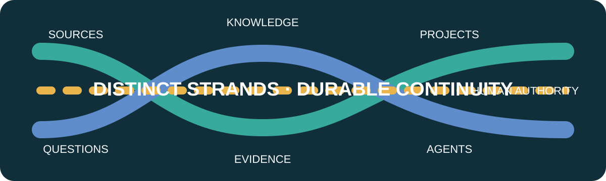
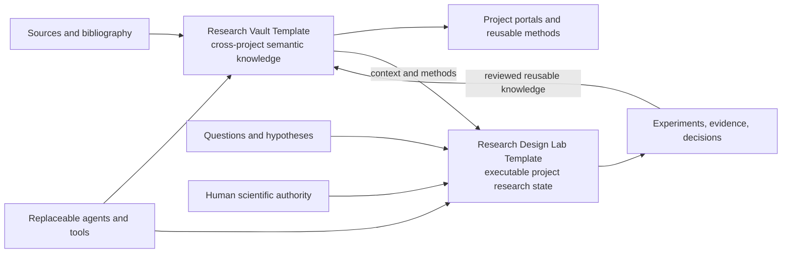

  

<strong>A Git-native research fabric for durable human-agent scientific work.</strong>

English | <a href="README.zh-CN.md">简体中文</a>

  
  
  

<a href="MANIFESTO.md">Manifesto</a> · <a href="docs/architecture/overview.md">Architecture</a> · <a href="#the-template-pair">Components</a> · <a href="docs/philosophy/README.md">Philosophy</a> · <a href="CONTRIBUTING.md">Contributing</a>

> Research state should outlive a chat, an agent, a provider, a workstation, and the assumptions of a single session.

## Why ResearchFabric?

AI-assisted science needs a durable place for questions, evidence, knowledge, terminology, and explicit decisions. Conversation can help produce that state, but conversation is not the state itself. ResearchFabric is an opinionated, minimal-infrastructure approach to AI4S and agent-native research: Markdown and structured metadata, Git review, direct native tools, explicit evidence, and visible authority boundaries.

It treats AI agents as replaceable research assistance and execution substrates. Agents may search, synthesize, implement admitted experiments, and propose interpretations. They do not turn model output into evidence or silently make scientific decisions.

## Architecture

Knowledge and evidence are connected, not interchangeable. The Vault captures reviewed meaning that can travel across projects. The Design Lab keeps a project's hypotheses, methods, runs, evidence, failures, and adopted decisions executable and traceable. Zotero and large-asset systems remain authoritative for the data they manage.

## The Template Pair

| Component | Responsibility | Repository |
| --- | --- | --- |
| RVT — Research Vault Template | Obsidian-compatible, cross-project semantic knowledge and promotion workflows. | [research-vault-template](https://github.com/JerrySkywalker/research-vault-template) |
| RDLT — Research Design Lab Template | Executable project research state: hypotheses, experiments, evidence, and decisions. | [research-design-lab-template](https://github.com/JerrySkywalker/research-design-lab-template) |

ResearchFabric is the public front door, not a third component. The components compose through explicit handoffs and compatible versions—not source copying, submodules, or a runtime parent.

## Principles

- Research state is not chat history.
- Knowledge is not evidence.
- Assistant recommendation is not an Owner or scientific decision.
- Git makes state durable and reviewable; Git is not proof.
- Research identity should survive providers, agents, machines, sessions, and time.
- Use external bibliography and durable-asset authorities without copying everything into Git.
- Prefer minimal, inspectable infrastructure over middleware without a demonstrated need.

## Maturity

ResearchFabric and the Template Pair are early-stage. The currently released stable pair baseline is `v0.2.0`. This portal describes an evolving approach and does not claim production or scientific validation merely from repository state.

## Documentation

- [Documentation map](docs/README.md)
- [Architecture overview](docs/architecture/overview.md)
- [Product topology](docs/architecture/product-topology.md)
- [Repository model](docs/architecture/repository-model.md)
- [Philosophy](docs/philosophy/README.md)
- [Compatibility-set example](compatibility/release-set.example.yaml)

## Contributing and license

Read [CONTRIBUTING.md](CONTRIBUTING.md) before proposing changes. ResearchFabric is licensed under the [MIT License](LICENSE); the [Simplified-Chinese translation](LICENSE.zh-CN.md) is unofficial and the English license controls.
