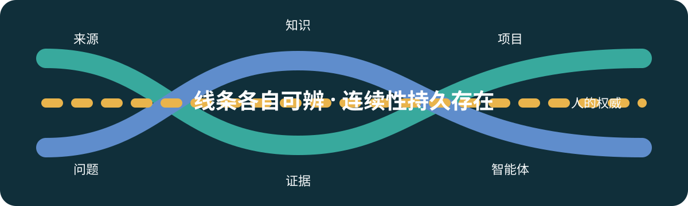
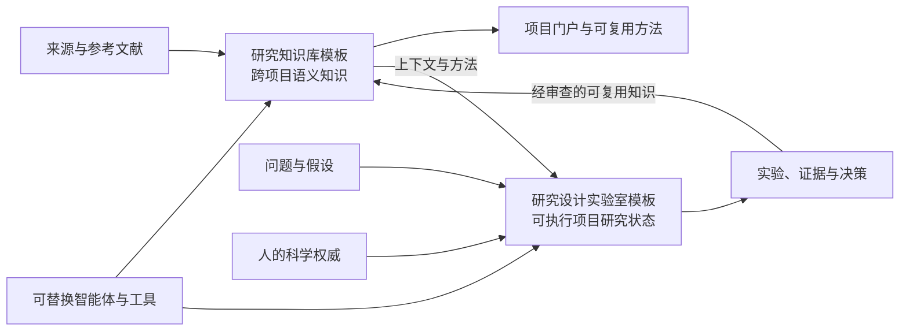

  

<strong>面向持久人机协作科研的 Git 原生研究织体。</strong>

<a href="README.md">English</a> | 简体中文

  
  
  

<a href="MANIFESTO.zh-CN.md">宣言</a> · <a href="docs/architecture/overview.zh-CN.md">架构</a> · <a href="#模板对">组件</a> · <a href="docs/philosophy/README.zh-CN.md">理念</a> · <a href="CONTRIBUTING.zh-CN.md">贡献</a>

> 研究状态应当跨越聊天、智能体、供应商、工作站以及单次会话的假设而持续存在。

## 为什么需要 ResearchFabric？

AI 辅助科研需要一个持久承载问题、证据、知识、术语和显式决策的地方。对话可以帮助生成这些状态，但对话本身不是规范研究状态。ResearchFabric 是一种有明确立场、保持最小基础设施的 AI4S／智能体原生科研方法：使用 Markdown 与结构化元数据、Git 审查、直接调用原生工具，并明确区分证据与权威。

AI 智能体被视为可替换的研究协助与执行载体。它们可以检索、综合、执行已准入实验并提出解释，但不能把模型输出变成证据，也不能暗中作出科学决策。

## 架构

知识与证据彼此关联，但不可互换。Vault 保存能够跨项目传播的经审查含义；Design Lab 保持项目假设、方法、运行、证据、失败和已采纳决策的可执行性与可追溯性。Zotero 和大型资产系统继续对其管理的数据负责。

## 模板对

| 组件 | 职责 | 仓库 |
| --- | --- | --- |
| RVT — Research Vault Template | 兼容 Obsidian 的跨项目语义知识与知识晋升工作流。 | [research-vault-template](https://github.com/JerrySkywalker/research-vault-template) |
| RDLT — Research Design Lab Template | 可执行项目研究状态：假设、实验、证据与决策。 | [research-design-lab-template](https://github.com/JerrySkywalker/research-design-lab-template) |

ResearchFabric 是公共入口，不是第三个组件。两个组件通过显式交接和兼容版本协作，而不是复制源码、使用子模块或依赖运行时父仓库。

## 原则

- 研究状态不是聊天历史。
- 知识不是证据。
- 助手建议不是 Owner 或科学决策。
- Git 使状态持久且可审查，但 Git 不是证明。
- 研究身份应跨越供应商、智能体、机器、会话和时间。
- 使用外部参考文献与持久资产权威，不要求把一切复制进 Git。
- 在没有明确需求时，优先采用最小且可检查的基础设施，而非中间件。

## 成熟度

ResearchFabric 与模板对仍处早期阶段。当前已发布的稳定模板对基线为 `v0.4.0`。本门户描述的是持续演进的方法，不会因为仓库中存在某个状态就宣称达到生产成熟度或科学有效性。

## 文档

- [文档地图](docs/README.zh-CN.md)
- [架构概览](docs/architecture/overview.zh-CN.md)
- [产品拓扑](docs/architecture/product-topology.zh-CN.md)
- [仓库模型](docs/architecture/repository-model.zh-CN.md)
- [理念](docs/philosophy/README.zh-CN.md)
- [兼容版本集示例](compatibility/release-set.example.yaml)

## 贡献与许可证

提交修改前请阅读 [CONTRIBUTING.zh-CN.md](CONTRIBUTING.zh-CN.md)。ResearchFabric 采用 [MIT 许可证](LICENSE)；[简体中文译文](LICENSE.zh-CN.md) 仅供参考，英文原文具有控制效力。
